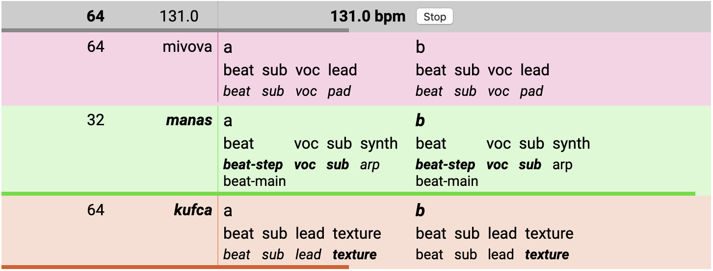

# Kytaime Throwdown
Browser-based MIDI and audio jamming sequencer.

### How does this work?

- _Section_: a chunk of song, e.g. chorus, verse, bridge, intro, ambient build, etc.
- _Part_: an instrument line or voice within a song, e.g. drums, bass, sub, vocal sample, synth, arp, chords, pad.
- _Pattern_: an individual loop for a part, e.g. bassline 1, main melody, alt verse chords, synth stab.

A song is loaded up horizontally in a coloured _deck_ row. Each section is a cell (column) within the row, with the section name in the top left.

Within a section, the part names are listed as columns, with patterns underneath each part.

Only one section within a row can be played at a time. Within a part, only one pattern can be played at a time. 

To toggle _trigger_ for a section or pattern, click the name. Playing sections/patterns are bold, triggered sections/patterns are italics. When something is toggled, it will trigger at the next valid point. In json you can configure start/end beats for patterns, so that they can start and at beats other than default zero (beginning/end of the loop).

### Where is the music data?
All pattern data is hard-coded in hjson.

Audio loops are loaded from local iTunes Media library. MIDI / note patterns are hard-coded in hjson song data.

If you want to experiment with this, you'll need to hack the hjson data, set up your own audio loops etc, and edit `index.js` to load your songs into decks at launch.

### Why?
I wanted to experiment with a more fluid style of sequencing. Similar to Ableton and other pattern-grid based approaches, but encode more musically-relevant info into the pattern data so pattern triggering always sounds nice and appropriate.

The goal is to make it easier to experiment and jam with loop-based musical material without it sounding stale and repetitive, and to free the performer from worrying about triggering or hitting notes at the exact right moment, to allow more room for experimenting with mix and arrangement live.

### How to build
- install node.js
- clone repository
- `npm install`
- `npm start`
- open http://localhost:3876/