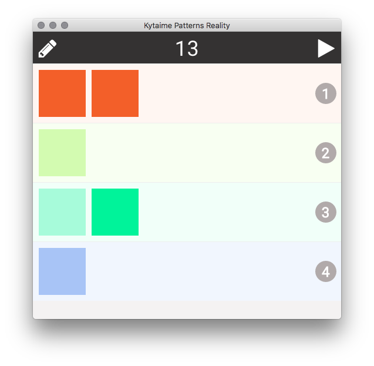

# *Kytaime* - javascript MIDI pattern sequencer

### About
This is a prototype midi pattern sequencer. When it grows up it will support jamming, live arrangement or performance workflows.

Right now you can import midi pattern loops into a grid, and trigger them so they play back, sending midi to other software or hardware via [Web MIDI](https://webaudio.github.io/web-midi-api/).

I wrote this for myself, for fun and the flexibility that I can adapt it to my needs. If it sounds interesting to you, [get in touch](mailto:kytaime@cartoonbeats.com)! 

### Quick Start
0. Requirements: node.js 8.9.4 (aka LTS). 
1. Clone this repo.
2. `npm install`
3. Run:
  - `npm run start-server` to start the server, browse to localhost:6041 (good for dev) OR
  - `npm start` to start the electron app

### Building Packaged App

### How To Use

- Toolbar:
  - Edit mode on/off (pencil icon, left).
  - Save session (menu icon).
  - Play/stop button in top right.
  - Current beat is displayed in the middle (when playing).
    - Click the number to set the tempo in BPM.
- Pattern grid:
  - When edit mode is enabled (red pencil):
    - Click + on a row to load a midi file.
    - Click :trash: to remove a pattern.
  - When edit mode is disabled:
    - Click a pattern cell to trigger. 
      - The border will highlight, indicating it is triggered.
        - If you click it again, you can untrigger it.
      - When triggered, patterns will play on the next appropriate beat; for example, mod 4.
      - Patterns loop until you untrigger.
        - They will stop at an appropriate beat, e.g. the end of the loop.
  - Each row transmits to a midi channel.
    - The channel number is displayed in the circle on the right.
    - (Currently outputs to "IAC Driver Bus 1".)
- Saving & reloading session:
  - Click the hamburger/save session icon in the toolbar.
    - Enter a name and tag (you might use this for different variations).
    - Click the tick mark and the file is saved (including a timestamp in the name).
  - Drag this file on to the pattern area to load.

### The Session File

You can do other things in the session file, such as change the midi channel for a row, or set the number of rows.

This is a [Hjson](https://hjson.org) format file, so you can have comments.

The whole state (aka [redux](http://redux.js.org) store state) of the app is saved in the file, but only certain things are loaded: `patterngrid`, `patterns` and `project`.

#### Session File - Note Patterns
Patterns have an `id`, `name`, `duration`, array of `notes`, and `startBeats` & `endBeats`.

`duration` is loop length.

`startBeats` is an array of beats that it's ok to start the pattern on. Defaults to `[ 0 ]`, i.e. the beginning. Similarly, `endBeats` is an array of beats where it's ok to stop the pattern. For example, if you have a pattern that sounds great on the first snare, you could set `startBeats: [ 0, 3 ]` or just `startBeats: [ 3 ]`. If you have a melody that starts with [anacrusis (pick-up notes)](https://en.wikipedia.org/wiki/Anacrusis), you'll probably want to set the endBeats and startBeats to reflect this so your pattern will start with the anacrusis.

#### Session File - Automation Patterns
You can set up simple automation patterns in the session file. These are similar to note patterns, but they have an array of automation `points` and a `controller` number. You'll need to refer to the pattern `id` in the grid or else you won't be able to trigger it. The controller value is linearly interpolated between the points.

### Technical Info
A [Web Worker](https://en.wikipedia.org/wiki/Web_worker) is used to get accurate timing no matter what. This currently doesn't work well in inactive [Google Chrome](http://google.com/chrome) tabs (i.e. minimised, hidden or offscreen) (worked wonderfully until recently, around Chrome 54). 

It's working great as an [Electron](http://electron.atom.io) app though.

You can use in a web browser by browsing to `localhost:6041`.

